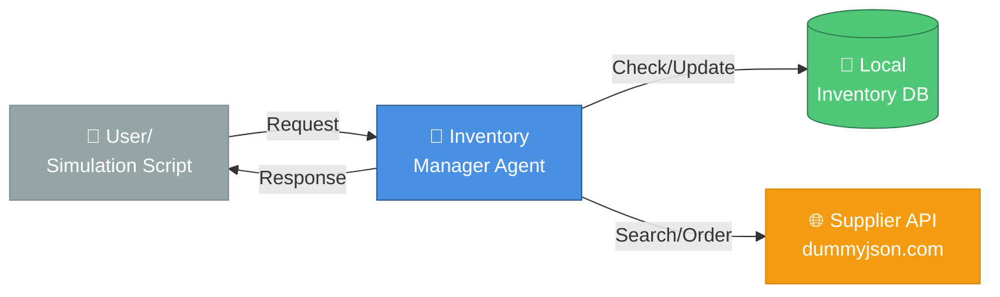
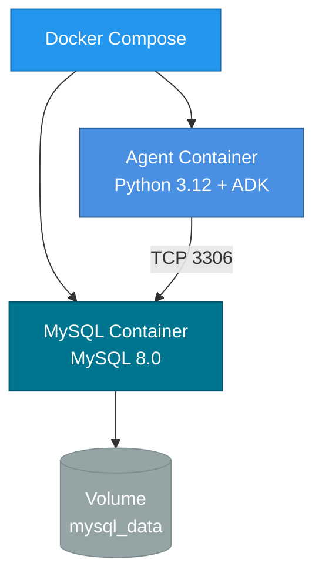
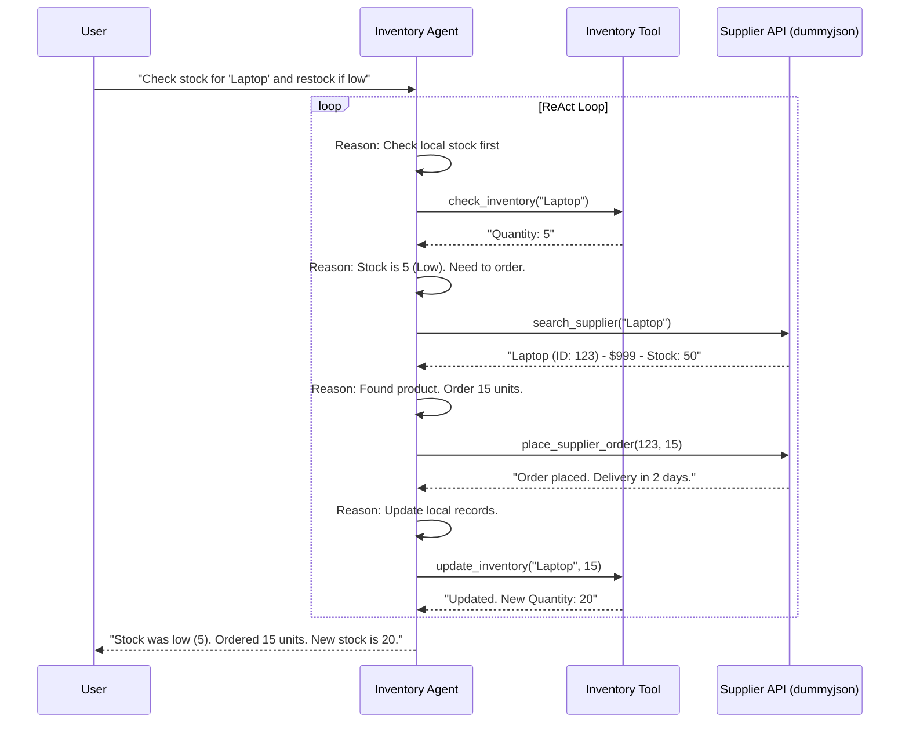

# Inventory Agent Architecture

This document describes the architecture of the ADK-based Inventory Agent.

## System Overview

The system consists of a single **Inventory Manager Agent** built with the Google ADK. It follows a **ReAct** (Reasoning + Acting) pattern to autonomously manage inventory levels.

## Architecture Diagram

## Component Details

### Agent (ReAct Pattern)
- **Reasoning**: Analyzes inventory levels and determines actions
- **Acting**: Executes tools to check stock, search suppliers, place orders
- **Guard Rails**: Rejects off-topic requests with polite explanations

### Tools

#### 1. **Inventory Database** (Configurable Backend)
- **In-Memory Mode** (default): Fast, stateless, perfect for demos
- **MySQL Mode** (optional): Persistent storage, production-ready
- Backend abstraction allows switching via environment variable

#### 2. **Supplier API**
- External API (dummyjson.com) for product search and ordering
- HTTP-based integration with error handling

## Deployment Options

### Option 1: Docker Compose (Recommended)

**Benefits**: One command setup, consistent environment, easy cleanup

### Option 2: Local Development
- In-memory database (no setup)
- Or connect to external MySQL instance

### Option 3: Production Deployment
- Deploy agent container to cloud (Cloud Run, ECS, etc.)
- Connect to managed MySQL (Cloud SQL, RDS, etc.)

## Sequence Diagram

The following sequence diagram illustrates the flow of the "Check & Restock" simulation scenario.

