# Inventory Agent Architecture

This document describes the architecture of the ADK-based Inventory Agent.

## System Overview

The system consists of a single **Inventory Manager Agent** built with the Google ADK. It follows a **ReAct** (Reasoning + Acting) pattern to autonomously manage inventory levels.

## Architecture Diagram

```mermaid
graph LR
    User[👤 User/<br/>Simulation Script]
    Agent[🤖 Inventory<br/>Manager Agent]
    DB[(💾 Local<br/>Inventory DB)]
    API[🌐 Supplier API<br/>dummyjson.com]
    
    User -->|Request| Agent
    Agent -->|Check/Update| DB
    Agent -->|Search/Order| API
    Agent -->|Response| User
    
    style Agent fill:#4A90E2,stroke:#2E5C8A,color:#fff
    style DB fill:#50C878,stroke:#2E7D4E,color:#fff
    style API fill:#F39C12,stroke:#D68910,color:#fff
    style User fill:#95A5A6,stroke:#7F8C8D,color:#fff
```

## Component Details

### Agent (ReAct Pattern)
- **Reasoning**: Analyzes inventory levels and determines actions
- **Acting**: Executes tools to check stock, search suppliers, place orders

### Tools
1. **Local Inventory DB**: In-memory storage for current stock levels
2. **Supplier API**: External API (dummyjson.com) for product search and ordering

## Sequence Diagram

The following sequence diagram illustrates the flow of the "Check & Restock" simulation scenario.

